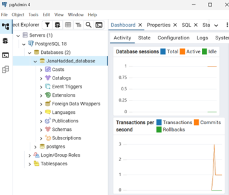
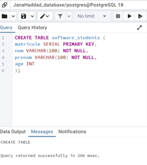
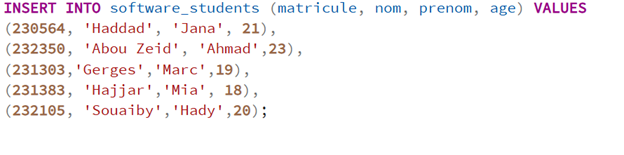
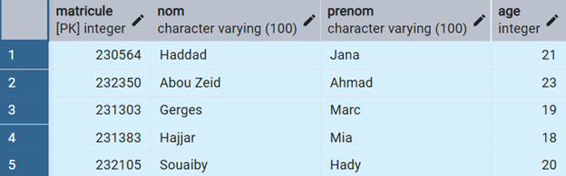
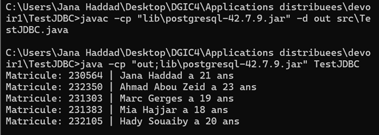
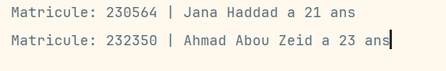

# JDBC Access from a Java Standalone Application to PostgreSQL 16

## Student Information

* **Name**: Jana Haddad (20564)
* **Course**: Applications Distribuées
* **Assignment**: Devoir 1 – JDBC


## Objective

The objective of this project is to implement **JDBC (Java Database Connectivity)** in order to allow a **Java standalone application** to access and interact with a **PostgreSQL 16 database**.

The application connects to a database, executes SQL queries, retrieves data from a table, and displays the results in the Java console.


## Software and Versions Used

|Software|Version|
|-|-|
|Operating System|Windows|
|Java JDK|Java 17|
|PostgreSQL|PostgreSQL 16|
|PostgreSQL JDBC Driver|postgresql-42.7.9|
|IDE|IntelliJ IDEA / VS Code|
|Database Tool|pgAdmin 4 / psql|
|Version Control|GitHub (Public Repository)|

## PostgreSQL Installation

PostgreSQL 16 was installed using the official PostgreSQL installer for Windows.

During installation:

* PostgreSQL Server was installed,
* pgAdmin 4 was installed,
* the default port **5432** was used,
* a password was configured for the `postgres` superuser.

## Database Creation

The database used in this project is named:


JanaHaddad_database



## Table Creation

Inside the database `JanaHaddad_database`, the following table was created:
CREATE TABLE software\_students (
    matricule INT PRIMARY KEY,
    nom VARCHAR(100),
    prenom VARCHAR(100),
    age INT
);



## Insert Data into the Table

Sample data was inserted into the table:

```sql


INSERT INTO software\_students VALUES
(230564, 'Haddad', 'Jana', 21),
(232350, 'Abou Zeid', 'Ahmad', 20),
(231303, 'Gerges', 'Marc', 25),
(231383, 'Hajjar', 'Mia', 18),
(232105, 'Souaiby', 'Hady', 20);

```



## Verify Table Content

```sql
SELECT \* FROM software\_students;
```



## JDBC Driver Installation

The PostgreSQL JDBC driver was downloaded from the official PostgreSQL website.

* Driver file used:
  postgresql-42.7.9.jar
* The `.jar` file was manually added to the Java project classpath.

## Java JDBC Implementation

The following Java standalone program was implemented:

```java
import java.sql.Connection;
import java.sql.DriverManager;
import java.sql.ResultSet;
import java.sql.Statement;

public class TestJDBC {

    public static void main(String\[] args) throws Exception {

        // Load PostgreSQL JDBC driver
        Class.forName("org.postgresql.Driver");

        // Open connection
        Connection cx = DriverManager.getConnection(
            "jdbc:postgresql://localhost:5432/JanaHaddad\_database",
            "postgres",
          // password 
        );

        // Create statement
        Statement st = cx.createStatement();

        // Execute SQL query
        ResultSet rs = st.executeQuery(
            "SELECT matricule, nom, prenom, age FROM software\_students"
        );

        // Process results
        while (rs.next()) {
            int matricule = rs.getInt("matricule");
            String nom = rs.getString("nom");
            String prenom = rs.getString("prenom");
            int age = rs.getInt("age");

            System.out.println(
                "Matricule: " + matricule + " | " +
                prenom + " " + nom + " a " + age + " ans"
            );
        }

        // Close resources
        rs.close();
        st.close();
        cx.close();
    }
}
```

## Program Execution

The program was compiled and executed successfully. 
 
The JDBC application successfully:

* connected to PostgreSQL 16,
* executed an SQL `SELECT` query,
* retrieved records from the database,
* displayed the results in the Java console.


## Show students older than 21
```java
import java.sql.Connection;
import java.sql.DriverManager;
import java.sql.ResultSet;
import java.sql.Statement;

public class TestJDBC {

    public static void main(String\[] args) throws Exception {

        // Load PostgreSQL JDBC driver
        Class.forName("org.postgresql.Driver");

        // Open connection
        Connection cx = DriverManager.getConnection(
            "jdbc:postgresql://localhost:5432/JanaHaddad\_database",
            "postgres",
          // password 
        );

        // Create statement
        Statement st = cx.createStatement();

        // Execute SQL query
        ResultSet rs = st.executeQuery(
            "SELECT matricule, nom, prenom, age FROM software\_students"
        );

        // Process results
        while (rs.next()) {
            int matricule = rs.getInt("matricule");
            String nom = rs.getString("nom");
            String prenom = rs.getString("prenom");
            int age = rs.getInt("age");

            System.out.println(
                "Matricule: " + matricule + " | " +
                prenom + " " + nom + " a " + age + " ans"
            );
        }

        // Close resources
        rs.close();
        st.close();
        cx.close();
    }
}
```


## Result
The console displays the students older than 21 years stored in the PostgreSQL database.



The JDBC application successfully:

* connected to PostgreSQL 16,
* executed an SQL `SELECT` query,
* retrieved records from the database,
* displayed the results in the Java console.


## GitHub Repository

The complete project is available in a **public GitHub repository**.  
The repository link is provided as **plain text** in the Moodle submission.


## Conclusion

This project demonstrates the correct implementation of **JDBC** to connect a **Java standalone application** to a **PostgreSQL database**, including database installation, table creation, driver configuration, SQL execution, and proper resource management.

